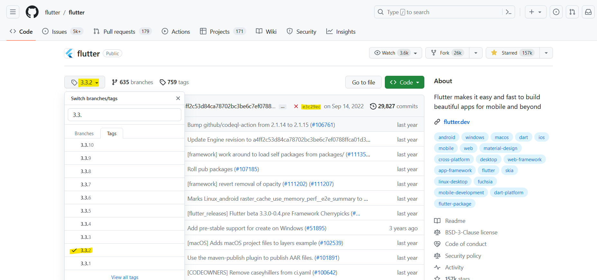

# Flutter web build docker

An example project on how to build Flutter web using docker (and also deploy it).

## Getting Started

To build a Flutter project you need, well, a project, so I used the default one when creating a new
project.

Once we have the project we have to configure the `Dockerfile` that will do the build and deploy.
For this, [Multi-Stage build](https://docs.docker.com/build/building/multi-stage/) is used, which
allows having two images in the same docker, one for the build, and another for the deploy.

### Dockerfile

```dockerfile
#STEP 1: BUILD
# Environemnt to install flutter and build web
FROM debian:latest AS build-env

#install all needed stuff
RUN apt-get update
RUN apt-get install -y curl git unzip

#define variables
ARG FLUTTER_VERSION=3.32.1
ARG FLUTTER_SDK_LOCATION=/usr/local/flutter
ARG APP_LOCATION=/app/

#clone flutter
RUN git clone https://github.com/flutter/flutter.git $FLUTTER_SDK_LOCATION
#change dir to current flutter folder and make a checkout to the specific version
RUN cd $FLUTTER_SDK_LOCATION && git checkout tags/$FLUTTER_VERSION

#setup the flutter path as an environment variable
ENV PATH="$FLUTTER_SDK_LOCATION/bin:$FLUTTER_SDK_LOCATION/bin/cache/dart-sdk/bin:${PATH}"

#Start to run Flutter commands
#doctor to see if all was installed ok
RUN flutter doctor -v

#create folder to copy source code
RUN mkdir $APP_LOCATION
#copy source code to folder
COPY . $APP_LOCATION
#stup new folder as the working directory
WORKDIR $APP_LOCATION

#Run build: 1 - clean, 2 - pub get, 3 - build web
RUN flutter clean
RUN flutter pub get
RUN flutter build web

#once heare the app will be compiled and ready to deploy

#STEP 2: DEPLOY
#use nginx to deploy
FROM nginx:1.25.2-alpine

#copy the info of the builded web app to nginx
COPY --from=build-env /app/build/web /usr/share/nginx/html

#Expose port and run nginx
EXPOSE 80
CMD ["nginx", "-g", "daemon off;"]
```

### Use specific Flutter Version
To use a specific version of Flutter, simply change the value of the `FLUTTER_VERSION` variable to a **tag** from the repository that represents the version you want to use. In this case the version 3.13.0 tag is being used.

### Use specific Flutter Checkout

If you want to use a specific commit due to a fork or something (IDK), you must modify the line:

```dockerfile
RUN cd $FLUTTER_SDK_LOCATION && git checkout tags/$FLUTTER_VERSION
```

And replace it with:

```dockerfile
RUN cd $FLUTTER_SDK_LOCATION && git checkout efbf63d9c66b9f6ec30e9ad4611189aa80003d31
```

Then, modifying the git checkout **hash** (`efbf63d9c66b9f6ec30e9ad4611189aa80003d31` in this example) to
the corresponding hash of the desired commit.

#### Obtain version **tag** and **hash**

To obtain the hash of a specific version, you must go to
the [flutter repo](https://github.com/flutter/flutter), deploy the **branches combo**, go to the **tags** tab, **select the tag** from the desired version, and **copy the hash** associated with the
committee of that tag, like this:


